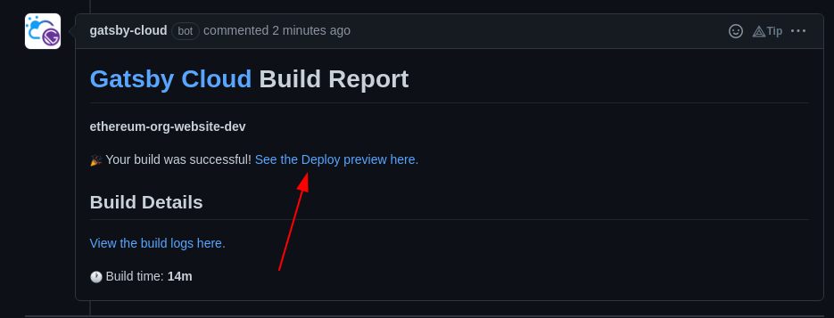

### 1. Submit an issue

- Create a [new issue](https://github.com/ethereum/ethereum-org-website/issues/new/choose).
- Comment on the issue (if you'd like to be assigned to it) - that way [our team can assign the issue to you](https://github.blog/2019-06-25-assign-issues-to-issue-commenters/).

More information on the issue creation process, and expectations around creating issues can be [found here](https://github.com/ethereum/ethereum-org-website/blob/dev/docs/github-issue-triage-process.md).

### 2. Fork the repository (repo)

- If you're not sure, here's how to [fork the repo](https://help.github.com/en/articles/fork-a-repo).

### 3. Set up your local environment (optional)

If you're ready to contribute and create your PR, it will help to set up a local environment so you can see your changes.

1. [Set up your development environment](https://www.gatsbyjs.com/docs/tutorial/part-zero/)

2. Clone your fork

If this is your first time forking our repo, this is all you need to do for this step:

```sh
git clone git@github.com:[your_github_handle]/ethereum-org-website.git && cd ethereum-org-website
```

If you've already forked the repo, you'll want to ensure your fork is configured and that it's up to date. This will save you the headache of potential merge conflicts.

To [configure your fork](https://docs.github.com/en/github/collaborating-with-issues-and-pull-requests/configuring-a-remote-for-a-fork):

```sh
git remote add upstream https://github.com/ethereum/ethereum-org-website.git
```

To [sync your fork with the latest changes](https://docs.github.com/en/github/collaborating-with-issues-and-pull-requests/syncing-a-fork):

```sh
git checkout dev
git fetch upstream
git merge upstream/dev
```

3. Install dependencies

We recommend using a node manager to use multiple node versions in your system. We use [Volta](https://volta.sh/). In case you don't use a manager or you use `nvm`, you can check the currently supported versions under the `"volta"` section on our `package.json` file.

```sh
yarn
```

### 4. Make awesome changes!

1. Create new branch for your changes off of your local `dev` branch

```sh
git checkout -b new_branch_name
```

2. Start developing!

Install dependencies and clear cache

```sh
rm -rf node_modules && yarn install && npx gatsby clean
```

Start the project

```sh
yarn start
```

- Open this directory in your favorite text editor / IDE, and see your changes live by visiting `localhost:8000` from your browser
- Pro Tip:
  - Explore scripts within `package.json` for more build options
  - Get **faster** local builds by building only one language. E.g. in your `.env` file, set `GATSBY_BUILD_LANGS=en` to build the content only in English

By default the script will build all the languages (complete list in `data/translations.json`) and will ignore the `/docs` and `/tutorials` folders. To control this behavior you can play with the `GATSBY_BUILD_LANGS` and `IGNORE_CONTENT` env variables. Check out `.env.example` to read more about them.

3. Commit and prepare for pull request (PR). In your PR commit message, reference the issue it resolves (see [how to link a commit message to an issue using a keyword](https://docs.github.com/en/free-pro-team@latest/github/managing-your-work-on-github/linking-a-pull-request-to-an-issue#linking-a-pull-request-to-an-issue-using-a-keyword)).

```sh
git commit -m "brief description of changes [Fixes #1234]"
```

4. Push to your GitHub account

```sh
git push
```

### 5. Local development with lambda functions

There may be times where you develop features that make external API requests to other services. For these we write lambda functions to obfuscate API keys.

To use an existing function locally you don't need to do anything. Just check that you have set the necessary ENV variables in the `.env` file.

To create a new function, you will need to create two files:

- One in `src/lambda` where the logic will live. These are the ones that will be deployed to Netlify. These functions follow [this format](https://docs.netlify.com/functions/build-with-javascript/#synchronous-function-format).
- One in `src/api` that will be just a wrapper around the previous one in order to be compatible with Gatsby functions. More on the [Gatbsy docs](https://www.gatsbyjs.com/docs/reference/functions/getting-started/) for the format they follow.

Typically, you will develop and test functions in the Gatsby context, by running `yarn start`.

In case you want to test them as if you were in a Netlify env, you can install the [Netlify CLI](https://docs.netlify.com/cli/get-started/) and run `netlify dev --framework=gatsby`.

### 6. Submit your PR

- After your changes are committed to your GitHub fork, submit a pull request (PR) to the `dev` branch of the `ethereum/ethereum-org-website` repo
- In your PR description, reference the issue it resolves (see [linking a pull request to an issue using a keyword](https://docs.github.com/en/free-pro-team@latest/github/managing-your-work-on-github/linking-a-pull-request-to-an-issue#linking-a-pull-request-to-an-issue-using-a-keyword))
  - ex. `Updates out of date content [Fixes #1234]`
- Gatsby Cloud (our hosting service for build previews) deploys all PRs to a publicly accessible preview URL, e.g.:
  
- _Confirm your GC preview deploy looks & functions as expected_
- Why not say hi and draw attention to your PR in [our discord server](https://discord.gg/CetY6Y4)?

### 7. Wait for review

- The website team reviews every PR
- See [how decisions are made on content changes](https://ethereum.org/en/contributing/#how-decisions-about-the-site-are-made)
- Acceptable PRs will be approved & merged into the `dev` branch

Learn more about how we review pull requests [here](docs/review-process.md).

### 8. Release

- `master` is continually synced to Netlify and will automatically deploy new commits to ethereum.org
- Learn more about how we deploy the site [here](docs/deploy-process.md)
- You can [view the history of releases](https://github.com/ethereum/ethereum-org-website/releases), which include PR highlights
